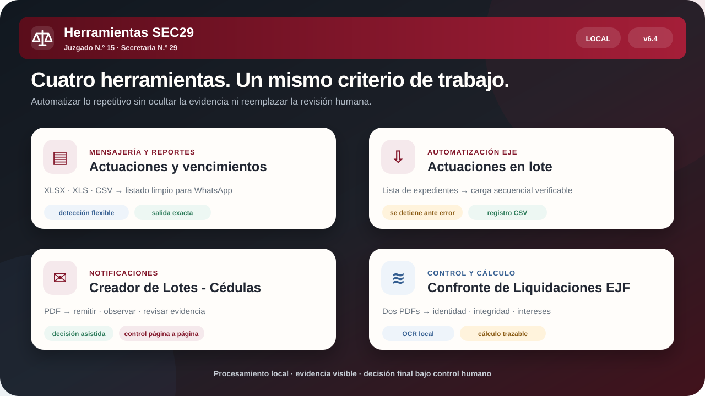

<p align="center">
  
</p>

<h2 align="center">Una sola puerta de entrada para las tareas operativas de la Secretaría 29.</h2>

<p align="center">
  Procesamiento documental, automatización asistida y control judicial con datos locales y decisión humana.
</p>

<p align="center">
  <a href="https://sinergiaestudio.github.io/herramientas-j15sec29/"><strong>Abrir Herramientas SEC29</strong></a>
  ·
  <a href="https://biblioteca-judicial-inteligente.arielmarcelogomez7.chatgpt.site">Sistema de Actuaciones Judiciales</a>
  ·
  <a href="https://sinergiaestudio.github.io/herramientas-j15sec29/?modo=procesador-actuaciones#procesadores">Procesador rápido</a>
  ·
  <a href="https://sinergiaestudio.github.io/herramientas-j15sec29/#lotes-actuaciones">Lotes - Actuaciones</a>
  ·
  <a href="https://sinergiaestudio.github.io/Cedulas-EJE-v1.0/">Lotes - Cédulas</a>
  ·
  <a href="https://sinergiaestudio.github.io/Confronte-Liquidaciones-EJF-v2.1.0/">Confronte EJF</a>
  ·
  <a href="https://github.com/sinergiaestudio">Autor</a>
</p>

<p align="center">
  
  
  
  
  
</p>

---

## Qué es Herramientas SEC29

Herramientas SEC29 es una suite web modular creada para resolver tareas repetitivas del **Juzgado N.º 15 · Secretaría N.º 29** sin instalar programas ni transferir documentación judicial a servidores externos.

La suite reúne procesadores de planillas, marcadores operativos para EJE y aplicaciones especializadas que conservan una experiencia visual común: cabecera institucional, menú lateral minimizado, selector de tema visible y accesos cruzados entre módulos.

> **Menos tareas mecánicas. Más tiempo para revisar, decidir y controlar.**

## Vista general

<p align="center">
  
</p>

## Módulos disponibles

| Módulo | Función | Resultado |
|---|---|---|
| **Actuaciones y vencimientos** | Lee exportaciones XLSX, XLS o CSV y detecta carátula, expediente, título o descripción. | Listado listo para copiar en WhatsApp o descargar como TXT. |
| **Creador de actuaciones en lote** | Carga números de expediente secuencialmente en la pantalla Crear actuación. | Registro controlado de cargas, duplicados y errores. |
| **Creador de Lotes - Actuaciones** | Recorre expedientes en Crear lote con estado BORRADOR mediante `Aplicar y agregar → Limpiar`. | Borradores incorporados al lote, con verificación y registro CSV. |
| **Creador de Lotes - Cédulas** | Analiza PDFs de confronte, separa remisiones, observaciones y casos ambiguos. | Lista revisable para Crear lote y acceso asistido a EJE. |
| **Confronte de Liquidaciones EJF** | Compara constancias de deuda y liquidaciones mandatarias y recalcula intereses. | Control de identidad, integridad nominal y cálculo trazable. |

## Ventana rápida del Procesador de actuaciones

La versión 6.7 agrega un acceso opcional dentro de la tarjeta **Procesador de actuaciones**. El botón puede arrastrarse a la barra de marcadores de Chrome.

Al ejecutarlo:

- abre una ventana compacta que contiene únicamente el procesador de actuaciones;
- reutiliza exactamente la misma tarjeta, validaciones y formato de salida de la suite;
- mantiene visible el selector de tema claro u oscuro;
- permanece abierta hasta que el usuario la cierre;
- si se vuelve a pulsar el marcador, enfoca la misma ventana sin recargarla ni perder el resultado procesado;
- no inyecta código en EJE ni necesita que la pestaña activa sea una página determinada.

La dirección compacta también puede abrirse directamente:

```text
https://sinergiaestudio.github.io/herramientas-j15sec29/?modo=procesador-actuaciones#procesadores
```

## Creador de Lotes - Actuaciones

El módulo 6.5 incorpora un marcador específico para la pantalla **Actuaciones → Crear lote** de EJE.

Flujo:

```text
Expediente
→ Aplicar y agregar
→ comprobar que el expediente aparezca
→ Limpiar
→ siguiente expediente
```

Controles incorporados:

- exige que el estado visible sea **BORRADOR**;
- detecta el campo **Expediente — CUIJ o Número, Año y Sufijo**;
- permite elegir manualmente el campo si la detección falla;
- acepta números de expediente y CUIJ;
- valida formatos y elimina duplicados;
- dispone de pausa, omisión y detención;
- se detiene si EJE no confirma el resultado o no limpia el campo;
- exporta un registro CSV;
- nunca presiona el botón inferior **Agregar**.

## Una experiencia común

- menú lateral completamente minimizado en cada apertura;
- navegación responsive para computadora, tablet y teléfono;
- tema claro y oscuro con preferencia persistente;
- páginas completas, sin ventanas internas ni scroll anidado;
- procesamiento local de planillas y PDFs;
- avisos de seguridad y límites funcionales visibles;
- crédito de autoría común y enlaces entre herramientas;
- control humano antes de crear actuaciones, lotes o decisiones definitivas.

## Accesos directos

| Herramienta | Dirección |
|---|---|
| Entrada unificada IA JUDICIAL | [Sistema de Actuaciones Judiciales](https://biblioteca-judicial-inteligente.arielmarcelogomez7.chatgpt.site) |
| Suite principal | [sinergiaestudio.github.io/herramientas-j15sec29](https://sinergiaestudio.github.io/herramientas-j15sec29/) |
| Actuaciones y vencimientos | [Abrir módulo](https://sinergiaestudio.github.io/herramientas-j15sec29/#procesadores) |
| Procesador de actuaciones — ventana rápida | [Abrir ventana compacta](https://sinergiaestudio.github.io/herramientas-j15sec29/?modo=procesador-actuaciones#procesadores) |
| Creador de actuaciones en lote | [Abrir módulo](https://sinergiaestudio.github.io/herramientas-j15sec29/#actuaciones-lote) |
| Creador de Lotes - Actuaciones | [Abrir módulo](https://sinergiaestudio.github.io/herramientas-j15sec29/#lotes-actuaciones) |
| Creador de Lotes - Cédulas | [Abrir aplicación](https://sinergiaestudio.github.io/Cedulas-EJE-v1.0/) |
| Confronte de Liquidaciones EJF | [Abrir aplicación](https://sinergiaestudio.github.io/Confronte-Liquidaciones-EJF-v2.1.0/) |

## Procesadores para WhatsApp

La salida conserva el formato operativo habitual.

Un único resultado se exporta sin numeración:

```text
*CARÁTULA - Expte. Nro 12345/2026-0* (título de la actuación)
```

Dos o más resultados se numeran correlativamente:

```text
1) *CARÁTULA - Expte. Nro 12345/2026-0* (primer título)
2) *CARÁTULA - Expte. Nro 67890/2026-0* (segundo título)
```

Para vencimientos se conserva `Expte. N°` y se excluyen las descripciones vacías o genéricas `VTO`.

## Principios de diseño

### Procesamiento local

Las planillas y los PDFs se leen en el navegador. La suite no mantiene una base de datos de expedientes ni sube documentos al repositorio.

### Automatización asistida

Los marcadores completan campos visibles, ejecutan acciones operativas y se detienen cuando no pueden verificar el resultado. No firman ni sustituyen la decisión del usuario.

### Evidencia visible

Los módulos exponen resultados, fundamentos, trazabilidad y casos que requieren revisión. La automatización no oculta la incertidumbre.

### Identidad compartida

La paleta bordó, grafito, marfil y dorado apagado identifica a la familia de herramientas sin utilizar emblemas oficiales ni presentarlas como sistemas institucionales del Consejo de la Magistratura.

## Arquitectura

```text
Herramientas SEC29
├── Procesadores locales
│   ├── Actuaciones
│   └── Vencimientos
├── Automatización EJE
│   ├── Creador de actuaciones en lote
│   ├── Creador de Lotes - Actuaciones
│   └── Creador de Lotes - Cédulas
└── Control y cálculo
    └── Confronte de Liquidaciones EJF
```

Los módulos simples viven en este repositorio. Cédulas y Confronte conservan repositorios independientes para mantener aislados sus motores de PDF, OCR, auditoría y cálculo, pero comparten navegación e identidad visual.

## Privacidad y alcance

- no se versionan planillas, PDFs reales, registros de carga ni credenciales;
- los marcadores operan sobre una sesión de EJE ya autenticada;
- la documentación judicial permanece bajo control del usuario;
- las herramientas son desarrollos de asistencia interna;
- no constituyen sistemas oficiales del Consejo de la Magistratura de la Ciudad Autónoma de Buenos Aires.

## Desarrollo y publicación

La suite es una aplicación estática publicada desde `/docs` mediante GitHub Pages.

```bash
npm test
```

Las pruebas verifican formatos, filtros, navegación, menú lateral, tema, ventana rápida y consistencia de los marcadores EJE.

## Repositorios relacionados

- [Cédulas EJE](https://github.com/sinergiaestudio/Cedulas-EJE-v1.0)
- [Confronte de Liquidaciones EJF](https://github.com/sinergiaestudio/Confronte-Liquidaciones-EJF-v2.1.0)
- [Diplomaker](https://github.com/sinergiaestudio/diplomaker)
- [Perfil de Marcelo Gómez](https://github.com/sinergiaestudio/marcelo-gomez)

## Autoría

Diseño y desarrollo: **[Marcelo Gómez](https://github.com/sinergiaestudio)**  
Juzgado N.º 15 · Secretaría N.º 29  
Biblioteca de Mero Trámite · innovación aplicada a la gestión judicial.
